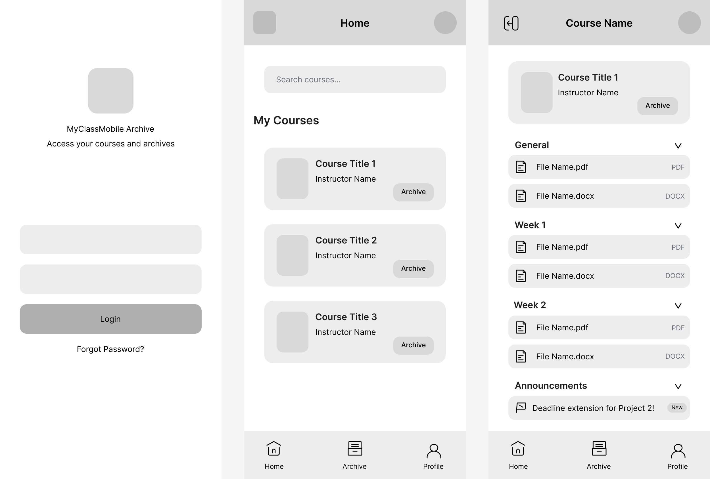

# MyClassMobile Archive UI/UX

A modern mobile-first LMS archive application UI/UX project designed in Figma.

This project includes:
- Design System
- Wireframes
- Final Mobile UI
- Reusable Components
- Variants & Auto Layout
- Course archive experience

---

## Project Structure

```text
exports/
├── png/
│   ├── Design System.png
│   ├── Wireframes.png
│   ├── Login Screen.png
│   ├── Home Screen.png
│   └── Course Detail Screen.png
│
└── pdf/
    ├── Design System.pdf
    ├── Wireframes.pdf
    ├── Login Screen.pdf
    ├── Home Screen.pdf
    └── Course Detail Screen.pdf
```

---

## Design System


---

## Wireframes



---

## Final UI Screens

### Login Screen


### Home Screen


### Course Detail Screen


---

## Features

- Mobile-first design
- Minimal UI hierarchy
- Archive-focused structure
- Course material organization
- Weekly content sections
- Announcement system
- Reusable components
- Variants
- Auto Layout
- Clean spacing system

---

## Tools

- Figma
- Git
- GitHub

---

## Author

Uğur Ege Çelik
